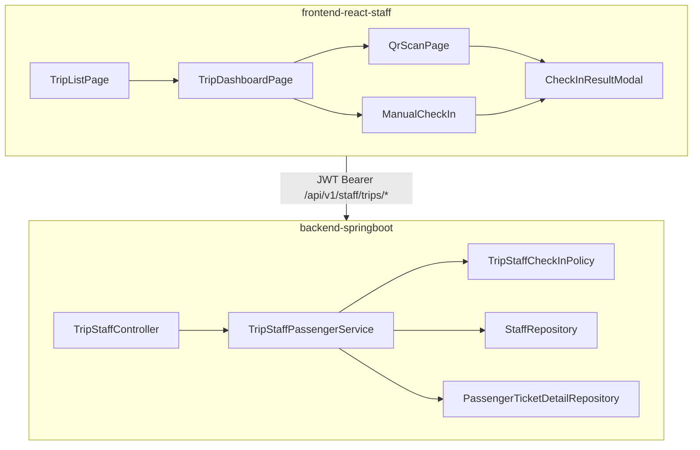

# Trip Staff — Passenger Check-in Implementation Plan

> Editable plan for TRIP_STAFF role (FE mobile + BE).  
> Last updated from design discussions. **Do not treat this file as auto-synced with code** — update manually as implementation progresses.

---

## Scope

| In scope | Out of scope (this iteration) |
|----------|-------------------------------|
| Assigned trip list (today / tomorrow) | Cargo load/unload logic |
| Trip dashboard — Passenger tab | Functional luggage label printing |
| Manual check-in (search + card + button) | Updating `passenger_ticket` or `trip_seat` on check-in |
| QR check-in (camera in mobile browser) | Per-stop pickup ETA window |
| Mobile-first UI in `frontend-react-staff` | |

**Core status change:** `passenger_ticket_detail.status`: `CONFIRMED` → `CHECKED_IN`.

---

## Agreed decisions

| # | Topic | Decision |
|---|-------|----------|
| 1 | Assigned trips | Only trips where `driverId = staffId OR attendantId = staffId` |
| 2 | Check-in window | **Open:** `departureTime - 30 minutes` · **Close:** `departureTime + route.totalMinutes` |
| 3 | Trip status gate | **None** — window is time-only per above |
| 4 | Re-scan CHECKED_IN | Error (red modal): "Vé đã được quét trước đó" |
| 5 | QR payload | Opaque token string (32-char hex, no dashes); BE lookup via `passenger_ticket_detail.qrcode` |
| 6 | QR generation timing | **Already implemented** — on SEPAY payment complete via `BoardingQrTokenGenerator` in `PaymentServiceImpl.completePassengerPaymentTarget()` |
| 7 | tripId validation | `passenger_ticket.tripId` must equal path `{tripId}` |
| 8 | staffId validation | Resolve from JWT `accountId` → `staff`; must match `driverId` or `attendantId` |
| 9 | QR success modal | Auto-close ~**10 seconds**; large seat/pickup/dropoff; early dismiss button |
| 10 | Manual success modal | Staff closes manually |
| 11 | Seat map | Read-only modal; gray = empty, yellow = CONFIRMED, green = CHECKED_IN |
| 12 | Print label button | Always visible, **disabled for all** (demo UC only) |
| 13 | Accompanied child | Secondary row on passenger card: `fullname`, `birthYear` |
| 14 | Landing after login | `/staff/trip/list` |
| 15 | Cargo tab | Empty placeholder — "Tính năng đang phát triển" |
| 16 | Passenger search | Client-side filter by phone / name on dashboard list (same flow as manual check-in) |
| 17 | Ngrok mobile test | **Option B:** one ngrok tunnel → FE port 2999 + Vite `/api` proxy → BE |
| 18 | qrcode index | Optional filtered UNIQUE index `WHERE qrcode IS NOT NULL` |

---

## Architecture



---

## Check-in validation pipeline

Shared by QR and manual endpoints via `TripStaffCheckInPolicy`.

### Inputs

- **QR:** `POST /api/v1/staff/trips/{tripId}/passengers/check-in/qr` — body `{ "qrToken": "<uuid>" }`
- **Manual:** `POST /api/v1/staff/trips/{tripId}/passengers/{ticketDetailId}/check-in`

### Steps (in order)

1. **Auth:** JWT → `accountId` → `staffId` (staff exists, active).
2. **Trip assignment:** Trip `{tripId}` exists; `driverId = staffId OR attendantId = staffId`. Else 403 — "Bạn không được phân công chuyến này".
3. **Time window** (no trip.status check):
   - Load `trip.departureTime` and `route.totalMinutes` via `trip.routeId`.
   - `checkInOpen = departureTime - 30 minutes`
   - `checkInClose = departureTime + totalMinutes`
   - If `now < checkInOpen` → "Chưa đến giờ check-in (mở lúc HH:mm)"
   - If `now > checkInClose` → "Đã hết thời gian check-in cho chuyến này"
4. **Lookup detail:** By `qrToken` or `ticketDetailId`.
5. **Cross-check trip:** `passenger_ticket.tripId == path tripId`. Else — "Vé thuộc chuyến đi khác".
6. **Ticket gates:**
   - `passenger_ticket.status == CONFIRMED`
   - `detail.status == CONFIRMED` → proceed
   - `detail.status == CHECKED_IN` → "Vé đã được quét trước đó"
   - CANCELLED / EXPIRED / PENDING → appropriate message
7. **Update:** `UPDATE ... SET status = 'CHECKED_IN' WHERE ticketDetailId = ? AND status = 'CONFIRMED'`.

### Success response (`CheckInResponse`)

```json
{
  "fullName": "...",
  "seatCode": "...",
  "pickupStopName": "...",
  "dropoffStopName": "...",
  "status": "CHECKED_IN",
  "accompaniedChild": { "fullname": "...", "birthYear": 2019 }
}
```

`accompaniedChild` is `null` when none.

---

## Phase 0 — BE prerequisites

> **Audit (codebase review):** Phase 0 is **partially done**. QR token generation exists; trip-staff lookup helpers and optional DB index still needed.

### Already implemented (no work required)

| Item | Location | Notes |
|------|----------|-------|
| QR token generator | [`BoardingQrTokenGenerator.java`](backend-springboot/src/main/java/com/ralsei/service/passengerbooking/BoardingQrTokenGenerator.java) | `UUID.randomUUID().toString().replace("-", "")` → 32-char hex |
| QR assigned on CONFIRMED | [`PaymentServiceImpl.completePassengerPaymentTarget()`](backend-springboot/src/main/java/com/ralsei/service/impl/PaymentServiceImpl.java) | Sets `detail.setQrcode(boardingQrTokenGenerator.generateToken())` when SEPAY webhook completes payment |
| Entity field | [`PassengerTicketDetail.qrcode`](backend-springboot/src/main/java/com/ralsei/model/PassengerTicketDetail.java) | `VARCHAR(MAX)` nullable |
| Fake data samples | [`fakedata.sql`](backend-springboot/db/fakedata.sql) | Test tokens for local DB |

**QR check-in lookup must use the stored token exactly** (no dashes). FE/scanner passes decoded string as-is in `{ "qrToken": "..." }`.

**Known gap (out of Phase 0 scope, note for later):** QR is only generated on the **SEPAY webhook** path today. If TICKET_STAFF counter sales (CASH / instant confirm) are added later, they must call the same token assignment when setting detail to CONFIRMED — otherwise those tickets would have `qrcode = NULL`.

### Remaining tasks

**Touch files:**

- [`StaffRepository.java`](backend-springboot/src/main/java/com/ralsei/repository/StaffRepository.java)
- [`PassengerTicketDetailRepository.java`](backend-springboot/src/main/java/com/ralsei/repository/PassengerTicketDetailRepository.java)
- [`ddl.sql`](backend-springboot/db/ddl.sql) (optional index only)

**Tasks:**

- [ ] `StaffRepository.findByAccountId(Integer accountId)` — `Optional<Staff>` (Spring Data derived method); used by Phase 1 to resolve JWT → `staffId`
- [ ] `PassengerTicketDetailRepository.findByQrcode(String qrcode)` — `Optional<PassengerTicketDetail>`; used by QR check-in lookup
- [ ] Optional: filtered unique index on `passenger_ticket_detail(qrcode) WHERE qrcode IS NOT NULL` in `ddl.sql`

**Removed from Phase 0 (already done):**

- ~~Generate qrcode on payment complete~~ → handled by `BoardingQrTokenGenerator` + `PaymentServiceImpl`

### Phase 0 exit criteria

Phase 0 is **complete** when the two repository methods exist (index optional). Phase 1 can start in parallel only after `findByAccountId` and `findByQrcode` are in place.

---

## Phase 1 — BE Trip Staff APIs

**New files:**

- `controller/TripStaffController.java`
- `service/tripstaff/TripStaffPassengerService.java`
- `service/tripstaff/impl/TripStaffPassengerServiceImpl.java`
- `service/tripstaff/TripStaffCheckInPolicy.java`
- DTOs: `AssignedTripProjection`, `TripStaffDashboardResponse`, `CheckInResponse`, request `QrCheckInRequest`

### Endpoints

| Method | Path | Description |
|--------|------|-------------|
| GET | `/api/v1/staff/trips?date=yyyy-MM-dd` | Assigned trips for date |
| GET | `/api/v1/staff/trips/{tripId}/passengers/dashboard` | Seats + passengers + summary |
| POST | `/api/v1/staff/trips/{tripId}/passengers/check-in/qr` | QR check-in |
| POST | `/api/v1/staff/trips/{tripId}/passengers/{ticketDetailId}/check-in` | Manual check-in |

- `@PreAuthorize("hasRole('TRIP_STAFF')")` on controller class or methods.
- Follow existing patterns: projections, `BusinessRuleException`, native/JPQL queries like `TripRepository`.

### Assigned trip card data (suggested)

- `tripId`, `routeName`, `departureTime`
- `licensePlate`, `coachTypeName`
- `assignedRole` — `DRIVER` | `ATTENDANT`
- `checkedInCount`, `totalPassengers` (CONFIRMED + CHECKED_IN details)

---

## Phase 2 — FE scaffolding

**New folder:** `frontend-react-staff/src/features/tripStaff/`

```
features/tripStaff/
  api/tripStaffApi.js
  hooks/useAssignedTrips.js
  hooks/useTripDashboard.js
  components/
    TripListCard.jsx
    TripDashboardTabs.jsx
    PassengerCard.jsx
    TripStaffSeatMapModal.jsx
    CheckInResultModal.jsx
    CargoTabPlaceholder.jsx
  routes/tripStaffRoutes.jsx
pages/tripStaff/
  TripListPage.jsx
  TripDashboardPage.jsx
  QrScanPage.jsx
```

**Update:**

- `frontend-react-staff/src/routes/AppRouter.jsx`
- `frontend-react-staff/src/routes/GuestGuard.jsx` — `TRIP_STAFF: "/staff/trip/list"`
- `frontend-react-staff/src/components/layout/MobileStaffLayout/` — header/back, `--ralsei-primary` colors

### Routes

| Path | Page |
|------|------|
| `/staff/trip/list` | TripListPage |
| `/staff/trip/:tripId/dashboard` | TripDashboardPage |
| `/staff/trip/:tripId/scan` | QrScanPage |

---

## Phase 3 — Trip List screen

- [ ] Date toggle: **Hôm nay / Ngày mai** (default today)
- [ ] Fetch `GET /staff/trips?date=`
- [ ] Card layout (not table): route, time, plate, coach type, check-in progress, role badge
- [ ] Navigate to dashboard on tap
- [ ] Loading / empty states

---

## Phase 4 — Trip Dashboard

### Tab Hành khách

- [ ] Stats: checked-in / total
- [ ] Search input — client-side filter phone + fullName
- [ ] `PassengerCard` per detail:
  - Name, phone, seat, pickup → dropoff, status badge
  - Accompanied child row when present
  - **Check-in** button (enabled if CONFIRMED)
  - **In nhãn hành lý** button (always disabled, tooltip demo)
- [ ] **Sơ đồ ghế** button → read-only modal (matrix from dashboard `seats` array)
- [ ] FAB **Quét QR** → `/staff/trip/:tripId/scan`

### Tab Hàng hóa

- [ ] `CargoTabPlaceholder` — static message only

### Manual check-in UX

1. Search by phone/name
2. Verify on card
3. Tap Check-in → POST manual → success modal (staff dismisses)

---

## Phase 5 — QR Scan

- [ ] Add dependency: `@yudiel/react-qr-scanner`
- [ ] Fullscreen `QrScanPage` with rear camera (`facingMode: 'environment'`)
- [ ] On decode → POST QR check-in → `CheckInResultModal`
  - **Success:** green, beep, large seat info, auto-close ~10s, "Quét tiếp"
  - **Error:** red, reason message, "Quét lại"
- [ ] Debounce duplicate QR reads while modal open

---

## Phase 6 — Ngrok mobile testing (Option B)

**Goal:** Phone opens one HTTPS ngrok URL; FE and BE both work.

### Setup

1. BE running locally (e.g. port 9090).
2. Update `frontend-react-staff/vite.config.js`:

```js
server: {
  port: 2999,
  strictPort: true,
  host: true, // allow LAN/ngrok
  proxy: {
    '/api': {
      target: 'http://localhost:9090',
      changeOrigin: true,
      secure: false,
    },
  },
},
```

3. Update `frontend-react-staff/src/api/axiosClient.js`:

```js
baseURL: '/api',  // relative — same origin through ngrok + vite proxy
```

4. Terminal: `npm run dev` (port 2999)
5. Terminal: `ngrok http 2999`
6. Phone: open `https://xxxx.ngrok-free.app` → allow camera when scanning

### Why this works

- Browser on phone calls `https://ngrok-url/api/...` (same origin as FE).
- Ngrok forwards to Vite on dev machine.
- Vite proxy forwards `/api` to local Spring Boot.
- `getUserMedia` requires HTTPS — ngrok provides it.
- CORS unchanged for proxied requests (same origin from browser view).

### Pitfalls

- Do **not** keep `baseURL: 'https://localhost:9090/api'` when testing on phone — `localhost` on phone is the phone itself.
- ngrok free URL changes each restart — re-open new URL on phone.

---

## Phase 7 — Polish

- [ ] Responsive `StaffLogin.jsx` / `StaffAuthLayout` for mobile viewport
- [ ] MobileStaffLayout: back button on dashboard/scan pages
- [ ] Smoke test full flow on phone via ngrok
- [ ] Confirm MANAGER / TICKET_STAFF routes unchanged

---

## Error messages reference

| Condition | Message |
|-----------|---------|
| QR not found | Mã QR không hợp lệ |
| Wrong trip | Vé thuộc chuyến đi khác |
| Already CHECKED_IN | Vé đã được quét trước đó |
| PENDING ticket/detail | Vé chưa được xác nhận |
| CANCELLED / EXPIRED | Vé đã bị hủy / hết hiệu lực |
| Before window | Chưa đến giờ check-in (mở lúc HH:mm) |
| After window | Đã hết thời gian check-in cho chuyến này |
| Staff not assigned | Bạn không được phân công chuyến này |

---

## Future extension (avoid refactor)

| Later feature | Where to add |
|---------------|--------------|
| Cargo load/unload | `TripStaffCargoService`, `/staff/trips/{tripId}/cargo/*`, Cargo tab UI |
| Luggage label print | Enable button + print API when rules defined |
| Server-side passenger search | New query param on dashboard endpoint if lists grow |

---

## Implementation order

```
Phase 0 → Phase 1 → Phase 2 → Phase 3 → Phase 4 → Phase 5 → Phase 6 → Phase 7
  BE         BE        FE shell    List      Dashboard    QR      ngrok    polish
```

---

## Progress tracker

| Phase | Status | Notes |
|-------|--------|-------|
| 0 — Prerequisites | ✅ Complete | QR gen done; `StaffRepository.findByAccountId`, `PassengerTicketDetailRepository.findByQrcode` implemented; optional qrcode index in ddl.sql |
| 1 — BE APIs | ✅ Complete | `TripStaffController`, `TripStaffPassengerService`, `TripStaffCheckInPolicy`, all DTOs, projections, repositories |
| 2 — FE scaffold | ✅ Complete | `features/tripStaff/` module with API, hooks, components, routes; `AppRouter.jsx` updated |
| 3 — Trip list | ✅ Complete | `TripListPage` with date toggle (today/tomorrow), `TripListCard`, loading/empty states |
| 4 — Dashboard | ✅ Complete | `TripDashboardPage` with tabs, search, passenger cards, seat map modal, check-in, cargo placeholder |
| 5 — QR scan | ✅ Complete | `QrScanPage` with `@yudiel/react-qr-scanner`, rear camera, result modal with beep/auto-close |
| 6 — Ngrok setup | ✅ Complete | `vite.config.js` with `host: true`, proxy config; `axiosClient` baseURL: `/api` |
| 7 — Polish | ✅ Complete | Mobile staff layout with back button; responsive auth layout; role-based routing |

_Update checkboxes and status as work completes._
